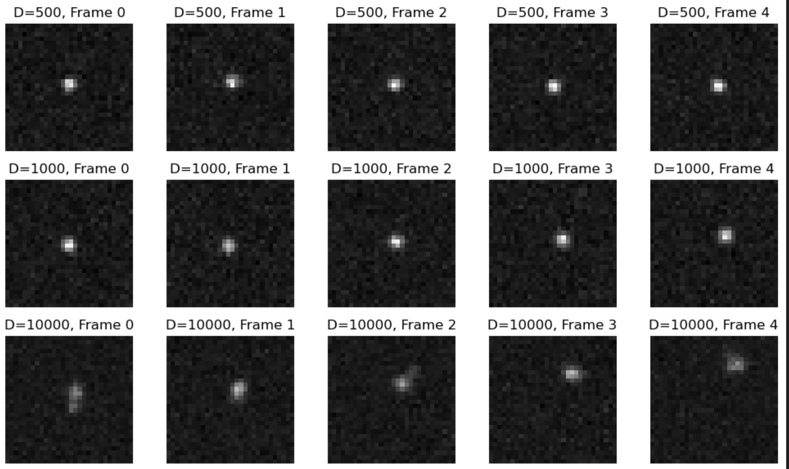

## ML for science project description (by Daniel Sage):

Single-Molecule Localization Microscopy (Nobel Prize 2014) is a powerful super-resolution technique for imaging live cell compartments with a resolution of up to 15 nm. In these images, a single moving molecule appears as a bright "blob," primarily due to motion blur. By analyzing the shape of this blob, we can gain insights into cellular dynamics, specifically by estimating the diffusion coefficient (D) of the molecule.
The goal of this project is to train a deep learning model to predict the diffusion coefficient (D) from a sequence of simulated images. These simulations can faithfully mimic real conditions, thanks to a well-known physical model that incorporates the Brownian motion of the molecule, the microscopy point-spread function, and the noise, allowing us to generate large datasets. We will investigate different neural network architectures to determine which one is most effective for estimating the diffusion coefficient from the sequence of images. Ultimately, we aim to replicate microscopy experimental conditions to apply this model to real images.
 

## Simulation
### Parameters:
Image size: Nx * Ny * Nt  
Nx = Ny = 100  
Nt: number of frames 10  
Interframe positions: 10  
The mollecule always starts in the center of the first frame.   
delta_t: Time between two frames: 10 ms  
Generate images for a chosen D in [10^-1, 10] (micro_meter)^2/second  
Microscope FWHM (Full width half maximum): 100nm (later push up to 250nm)  
Flux: 10 photons/ms  
Amplitude of diraqs: Flux * delta_t /Interframe positions  
PSF (Point Spread function): start with Gaussian, then use specified one 

## Reprducibility

In order to make this project reproducible, we included a `requirements.txt` file regrouping all python libraries we used, along with their versions. To install them, it is recommended to do so in a virtual environment; to create one, `python3 -m venv venv_name` is a useful command. After activating it, type `pip install -r requirements.txt` to install the libraries.
If this doesn't work, we also included a `Dockerfile`, which can be used to create a Docker Image to containerize the application. It is longer to set up but should work on all computers.

### Output Images:  
